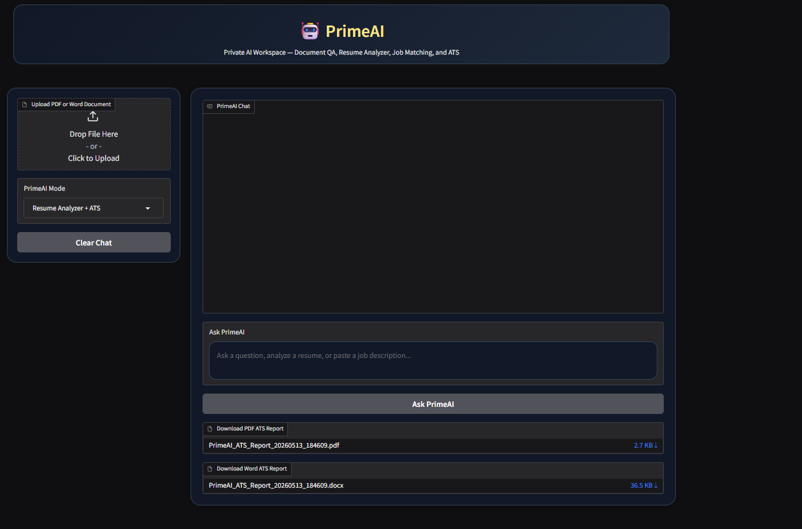
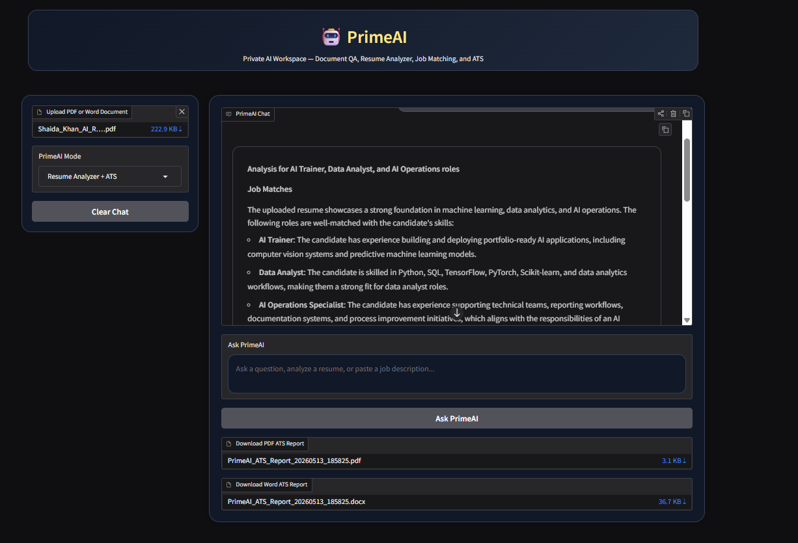

# 🤖 PrimeAI — AI Resume & Document Intelligence Workspace

PrimeAI is an AI-powered career and document intelligence workspace designed for ATS resume analysis, AI job matching, document QA, and recruiter-focused career recommendations.

Built for aspiring AI professionals, data analysts, and technical support candidates, PrimeAI combines AI-powered resume intelligence with exportable ATS reporting workflows.

## 🌐 Live Demo

🚀 Hugging Face Demo:
[PrimeAI Live Demo](YOUR_HUGGINGFACE_LINK)

### 🚀 Core Capabilities
- ATS Resume Analysis
- AI Job Matching
- AI Trainer / Data Analyst Role Evaluation
- Exportable PDF ATS Reports
- Exportable Word ATS Reports
- Resume Improvement Recommendations
- Document QA & Intelligence
- Recruiter-Focused Career Guidance

---

## ✨ Features

### 📄 Resume Analyzer + ATS
- AI-powered ATS resume analysis
- AI Trainer, Data Analyst, and AI Operations role matching
- Resume strengths and improvement recommendations
- Exportable PDF ATS reports
- Exportable Word ATS reports
- Recruiter-focused AI feedback


### 💼 Job Matching
- Analyze resume alignment with AI/Data roles
- Identify role-fit opportunities
- Evaluate technical strengths

---

## 🛠 Tech Stack

- Python
- Gradio
- LangChain
- Ollama
- ChromaDB
- ReportLab
- python-docx
- PyPDF
- docx2txt
- AI Resume Intelligence Workflows
- ATS Resume Analysis
- Document Intelligence Pipelines

---

---

## 🧠 System Architecture

PrimeAI combines multiple AI workflows into a unified recruiter-focused workspace:

- Resume Parsing
- ATS Scoring
- AI Role Matching
- Document Intelligence
- Recruiter Recommendation Generation
- Exportable Reporting
- AI Q&A Assistant

The application is designed using modular AI workflow pipelines and scalable deployment architecture for future SaaS expansion.

## 🌟 Portfolio Highlights
- Professional multi-panel AI workspace UI
- ATS-focused resume intelligence system
- AI-powered recruiter feedback generation
- Exportable PDF and Word ATS reports
- AI Trainer and Data Analyst role matching
- Document intelligence and QA workflows
- Portfolio-ready Hugging Face deployment architecture

## 🚀 Run Locally

```bash
pip install -r requirements.txt
python app.py
```

## 📸 Screenshots

### 🏠 PrimeAI Home


### 📄 Resume Analysis


### 🤖 AI Q&A Assistant
