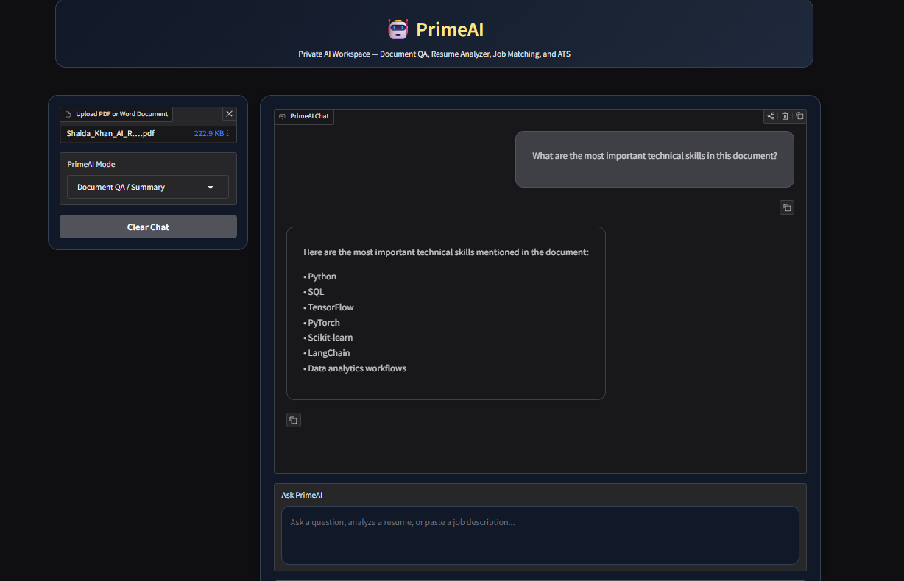

# 🤖 PrimeAI — AI Resume & Document Intelligence Workspace

PrimeAI is a multi-mode AI workspace designed for:

- Resume Analysis & ATS Review
- AI-Powered Document QA
- Job Matching Assistance
- Technical Skill Extraction
- Portfolio & Career Document Analysis

Built using:

- Python
- Gradio
- LangChain
- Ollama
- ChromaDB
- Document Intelligence Workflows

---

## ✨ Features

### 📄 Resume Analyzer + ATS
- Resume weakness analysis
- ATS-focused feedback
- Job-role matching
- Resume bullet improvement suggestions

### 📚 Document QA / Summary
- Upload PDF or Word documents
- Ask questions about uploaded files
- Extract skills, certifications, technologies, and project details
- AI-powered document summaries

### 💼 Job Matching
- Analyze resume alignment with AI/Data roles
- Identify role-fit opportunities
- Evaluate technical strengths

---

## 🛠 Tech Stack

- Python
- Gradio
- LangChain
- Ollama
- ChromaDB
- pypdf
- docx2txt

---

## 🚀 Run Locally

```bash
pip install -r requirements.txt
python app.py
```

## 📸 Screenshots

### 🏠 PrimeAI Home


---

### 📄 Resume Analyzer + ATS


---

### 📚 Document QA / Summary

